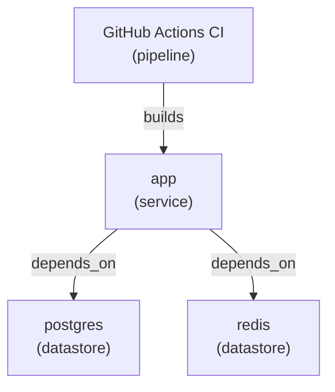

# Stackscope

Stackscope is a lightweight architecture discovery and blueprinting CLI for existing engineering environments. It scans common source and delivery artifacts, infers components and relationships, builds a reusable architecture model, and draws a big-picture ecosystem view from that model.

It is built for solution and enterprise architects who need to scan an unfamiliar setup and get to a usable architecture picture quickly, without manually diagramming it first.

## Mission

The mission is simple:

- scan engineering artifacts
- infer a normalized architecture model
- draw the environment from that model
- let users query and export the same blueprint

## Inputs, Model, Outputs

Stackscope has a clear boundary between what it reads and what it draws.

- Inputs: source artifacts such as YAML, JSON, Terraform, nginx config, and env examples
- Internal model: a normalized blueprint containing components, relationships, and evidence
- Outputs: browser architecture preview, Mermaid diagrams, markdown summaries, blueprint JSON, and view-state JSON

That means Stackscope does not draw directly from raw YAML or raw JSON. It scans those files, builds the blueprint, and then draws from the blueprint.

## What V1 Does

- scans a repo for common artifacts such as `docker-compose.yml`, `package.json`, GitHub Actions workflows, Kubernetes YAML, Terraform, `nginx.conf`, and env examples
- normalizes findings into components, relationships, integrations, cloud usage, and pipelines
- makes drawing a first-class step with browser preview and Mermaid export
- supports simple queries over the generated model
- renders an SVG-based ecosystem diagram in the browser
- generates a markdown architecture summary
- exports the model as JSON and an editable view state as JSON

## Repo Structure

```text
.
├── .codex/
├── docs/
├── examples/
├── src/
├── tests/
├── PRODUCT_SPEC.md
├── README.md
└── pyproject.toml
```

Relevant model docs:

- `docs/blueprint-model.md`
- `docs/blueprint.schema.json`

## Quick Start

```bash
python3 -m src.stackscope.cli scan examples/sample-app
python3 -m src.stackscope.cli scan examples/sample-app --json-out blueprint.json --view-out view.json
python3 -m src.stackscope.cli scan examples/sample-app --bundle-out bundle.json
python3 -m src.stackscope.cli draw examples/sample-app
python3 -m src.stackscope.cli draw examples/sample-app --format html
python3 -m src.stackscope.cli draw examples/sample-app --format svg --out architecture.svg
python3 -m src.stackscope.cli draw blueprint.json --format html --view view.json
python3 -m src.stackscope.cli draw bundle.json --format html
python3 -m src.stackscope.cli preview examples/sample-app --port 5123
python3 -m src.stackscope.cli preview examples/sample-app/blueprint.json --view examples/sample-app/view.json --port 5123
python3 -m src.stackscope.cli query examples/sample-app components
```

You can also install the CLI in editable mode:

```bash
pip install -e .
stackscope scan examples/sample-app
stackscope scan examples/sample-app --json-out blueprint.json --view-out view.json
stackscope draw examples/sample-app
stackscope draw blueprint.json --format html --view view.json
stackscope preview examples/sample-app --port 5123
```

The sample project also ships with checked-in saved artifacts:

- `examples/sample-app/blueprint.json`
- `examples/sample-app/view.json`
- `examples/sample-app/bundle.json`

That means you can test the saved-state workflow immediately without rescanning first.

## Commands

### `scan`

Scans a target directory, builds the internal blueprint model, and prints a short summary. Optional output files can be written in one run.

```bash
stackscope scan ./my-repo \
  --json-out blueprint.json \
  --view-out view.json \
  --bundle-out bundle.json \
  --markdown-out architecture.md \
  --mermaid-out architecture.mmd
```

`blueprint.json` is the normalized scan result. `view.json` is the editable layout file with node `x` and `y` positions. `bundle.json` stores both in one file.

### `draw`

Draws the inferred architecture as Mermaid. This is the fastest way to go from source artifacts to a big-picture diagram.

```bash
stackscope draw ./my-repo
stackscope draw ./my-repo --format markdown
stackscope draw ./my-repo --format html
stackscope draw ./my-repo --format svg --out architecture.svg
stackscope draw blueprint.json --format html --view view.json
stackscope draw ./my-repo --out architecture.mmd
```

The `draw` command can render directly from a repo scan or from a saved `blueprint.json`. When a `view.json` file is supplied, the browser view uses those saved node positions.

### `preview`

Serves a browser preview of the generated architecture view. By default it binds to `127.0.0.1:5123`.

```bash
stackscope preview ./my-repo
stackscope preview ./my-repo --host 0.0.0.0 --port 5123
stackscope preview blueprint.json --view view.json --port 5123
```

The preview uses an explicit SVG layout, not Mermaid, so node positions are real view-state data. Mermaid remains available as an export format.

### `query`

Runs a simple query against the inferred model.

Supported query values in V1:

- `components`
- `relationships`
- `cloud`
- `pipelines`
- `find:<term>`
- `type:<component-type>`

Examples:

```bash
stackscope query ./my-repo components
stackscope query ./my-repo type:service
stackscope query ./my-repo find:postgres
```

### `export`

Prints a specific renderer to stdout. `draw` is the preferred command when the immediate goal is a diagram.

```bash
stackscope export ./my-repo --format json
stackscope export ./my-repo --format view
stackscope export ./my-repo --format bundle
stackscope export ./my-repo --format markdown
stackscope export ./my-repo --format mermaid
stackscope export ./my-repo --format svg
stackscope export blueprint.json --format html --view view.json --out architecture.html
```

## How V1 Works

Stackscope walks the target directory, picks out known file patterns, and applies focused scanners. Each scanner emits components and relationships into a shared `Blueprint` model. The draw, query, markdown, JSON, and preview outputs all come from that same model.

This keeps the system easy to extend:

1. add a scanner
2. emit normalized model objects
3. get draw, query, and export behavior for free

For blueprinting work after the initial scan:

1. save `blueprint.json`
2. save `view.json`
3. adjust `view.json` node positions manually
4. redraw or preview from those saved files

## Current V1 Coverage

- Docker Compose services and `depends_on`
- `package.json` app metadata and package dependencies
- GitHub Actions workflows and reused actions
- Kubernetes manifests with basic workload and service detection
- Terraform providers and resources with cloud inference
- nginx upstream and proxy relationships
- env example files with integration-oriented variables

The scanners are heuristic by design in V1. They aim for useful discovery quickly, not exhaustive semantic fidelity.

## Blueprint Contract

The normalized blueprint model is the stable contract between scanning and drawing in V1.

- schema: `docs/blueprint.schema.json`
- explanation: `docs/blueprint-model.md`

## Development

Run tests:

```bash
python3 -m unittest discover -s tests
```

## Example Output

The included sample app demonstrates a mixed environment with an app service, Postgres, Redis, CI, Kubernetes, Terraform, and nginx.

```bash
stackscope draw examples/sample-app
```

Produces a Mermaid export similar to:



## Roadmap After V1

- richer query language
- improved cloud service mapping
- repo-to-repo and environment comparison
- optional graph storage
- richer saved view-state editing
- plug-in scanner system
